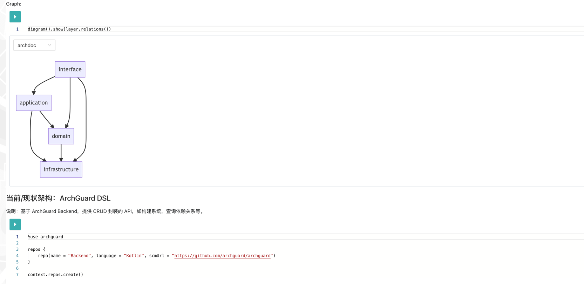

# 架构工作台：构建企业（应用）架构的数字孪生

> 架构工作台是一个环境，其设计初衷用于帮助人们设计架构、演进架构、观测架构，并有效地运用架构所需要的高质量工具，如交互式的架构开发和分析。

## 问题：为什么需要架构工作台？

在 ArchGuard 中，我们想治理的是架构的三种形态：**设计态**、**开发态**和**运行态**。对应于：

* 设计新的企业（应用）架构。诸如于描述和设计系统的当前架构。
* 理解和管控系统的现状。诸如于通过可视化的手段展示系统的现状、以规则来管理系统。
* 观测系统 <=> 架构的运行。

  同样，对于诸多中大型组织师的架构相关的部门来说，他们同样存在上述的这些问题。并且，我相信他们也面临着同我们构建 ArchGuard 时一样的困境：

1. 架构是多维的。包含技术、数据、安全、运维与系统等
2. 缺乏统一的架构**语言**。用于沟通的人类语言，诸如于什么是组件？
3. 系统的架构千奇百怪。架构风格或模式差异，如微服务架构、插件化架构等。
4. 缺乏业务上下文。作为一个外部架构师，帮助治理时缺乏一些上下文。
5. 细节是魔鬼。架构的世界丰富多彩，没有办法一一展现出来，比如一个小小的接口，可能会反转我们对于理解的假设。
6. 我们（ArchGuard 团队）目前的架构能力有限（\~\~这个不会写出来的\~\~）——  资深架构师太少。

所以，在实现这样一个标准化的架构模式系统之前，不如尝试构建一个更灵活的形式：架构工作台。它可以帮助我们更好地探索系统，也更符合我们的初期体验。

## 解决方案




### 什么是架构工作台

对于工作台这一概念来说，作为一个活跃的 DSL 创造者，我比较熟悉的是 Martin Fowler 在《领域特定语言》中对于语言工作台的定义：

> 语言工作台是一个环境，其设计初衷就是帮助人们构建新的 DSL，以及有效地运用这些 DSL 所需的高质量工具。

也因此在定义上，我们参考了老马的定义，并借鉴了现代化的工作台理念，主要有：RStudio 的**代码文档化**、Jupyter 的**交互性分析**。所以，我们的定义是：

> 架构工作台是一个环境，其设计初衷用于帮助人们设计架构、演进架构、观测架构，并有效地运用架构所需要的高质量工具，如交互式的架构开发和分析。

代码文档化，用于帮助我们更好地管理**架构代码**，将它融入软件开发生命周期里，如架构文档、用户故事、持续集成等。而交互性分析，则是用于帮助我们有效减少定制的代码，进而演变为提供的是 API 接口，与其定制化的代码。

对于架构工作台来说，它应用包含了以下一些核心功能与特性：

* 设计架构、演进架构与观测架构。
* 构建架构的数字孪生
* 说明性编程与显式设计

在这些特性中，我们认为**构建架构的数字孪生**是这个工作台最应该被重视的部分，而基础块则是：设计架构、演进架构与观测架构。

#### 基础：设计架构、演进架构与观测架构

在治理架构时，我们通常会关注于如何设计，如何演进，以及观测架构在运行时的状态。

* **设计架构。**这样的功能其并不能理解，难点是，如何提供高效的设计机制？采用 UI 拖拉拽的方式，又或者是 DSL，都有各种的博弈。总体来说使用代码会更加友好。而为了直观的展示架构的设计，我们会通过架构图来表示，这也就是系统的核心。
* **演进架构。**其核心是**构建架构治理模型**和**设计架构的适应度函数**，以引导系统进行有序的变更。从实现的层面来说，就是从对实现出来的软件架构（即代码等）进行分析，设计度量指标，并提供高质量的工具，来引导架构回归到合理的状态。
* **观测架构**。即观察架构的应用的运行状态，主要依靠于各类的 APM（application performance management，应用性能监测）工具。在云原生时代，相关的工具也非常的流行，如 Skywalking 等。

一个基础的架构工作台，应该考虑上述的三个要素。

#### 进阶：构建架构的数字孪生

理想的架构工作台，它应该提供一个可交互的架构的映射版本。它意味着：它是对系统或对象在其整个生命周期中的虚拟表示，我们可以根据实时数据进行更新，并使用**模拟、机器学习和推理**来帮助决策。

从概念上来说，它提供了一个非常美好的未来，难点就在于如何实现这样的系统？

我们正在设计 ArchGuard 的数字孪生版本，则围绕于这三种形态的架构形式（从实现的层面考虑的）：

* 设计态。关注于**边界**、**概念**与**交互**。
* 开发态。关注于**层级、依赖**与**模块**。
* 运行态。关注于**性能**、**链路层级**与**资源使用**。

这个版本相当于是设计态，在实现的时候，还会受到开发能力和数据上的制约。未来，我们是不是也应该代码及其架构孪生的双向绑定？

#### 核心：说明性编程与显性设计

我们所熟悉的各类架构相关的规范，它存在着诸多的问题，诸如于：**规范不直观、规范没有自动化**等。为了有效的演进架构，我们需要有效地结合规范、代码、设计，也就是说明性编程与显性设计，它们都是来自于 PL（编程语言）/ DSL（领域特定语言）中的概念。

* **说明性编程**（illustrative programming）是用于加强执行结果的解释性，如在架构治理的场景下，通过**生成架构图**来理解 DSL 编写的结果。另外一类觉的方式，有诸如于 Excel 中的表格和图表等。详细可以查看文末 Martin Fowler 的相关文章。
* **显式设计**。**显式**是通过明确编写要完成的指示来完成所需更改的手动方法。显示设计则是指引我们如何构建好系统的描述语言，诸如于 ADL（架构描述语言）的 DSL。除了，使用贴进架构描述的语言，还有用于支撑 DSL 的工具支撑，如编辑器智能感知。

这两个特性是围绕于**架构即代码**这一理念所改善的，诸如于 PlantUML、Graphviz 这一类图表即代码（Diagrams as code）也具备了这样的特质。

#### 其它特质

当然，为了让这个系统更好用，我们还需要其它的一系列特性：

* 架构演进的模拟验证。在构建了架构的数字孪生之后，我们就可以
* 易于扩展的功能。即采用微内核架构，即插件化、微前端化等。

依旧还有诸多东西可以探索，等待我们构建完第一个版本后，再展开讨论。

## 示例：ArchGuard 架构工作台

### 原型参考与设计：可交互环境与文档体验

什么是文档？什么是代码？两者没有一个明确的界限，文档是可执行的，代码也是可执行的。不过，从最终的形态上来说，它们都是知识。所以，重点依旧在于如何将这些知识显式化。所以从原型参考上，我们关注于：可交互环境与文档体验设计。

### 可交互环境：Jupyter & Zeppelin &  Nteract

作为交互性编程的业内代表，Jupyter 成为了我们研究的第一个对象。不过，从实现上，我们并没有从它本身的源码上汲取到太多的内容（ “代码”）。反而是，围绕于它的生态及竞争对手上，我们看到了一些更有意思的亮点，诸如于 Kotlin Jupyter、Zeppelin、Nteract 等。

* Nteract 提供了一系列的组件、SDK 来，用来构建交互式应用，诸如于消息通信等等。然而 Nteract ，在设计的时候主要是在 Electron 环境下使用，所以有一些库是无法使用的，如 ZeroMQ —— 设计时是只针对于 Node 环境的。
* Zeppelin 构建了一个更简单的执行环境（Interpreter），与 Jupyter 的 Kernel API 相比，它可以提供一些更有意思的实现层面的抽象。
* Kotlin Jupyter 则成了我们现在实现的一个基石。因为它还处于早期试验阶段，我们在构建的过程中，遇到过一系列的依赖包丢失的情况。

回过头来看，我们应该需要再回去看看 Jupyter 的抽象接口，或许能再提供更多的思路。

### 文档阅读体验与文档工程体验

对于文档体验来说，我一直主张应该关注于两个部分：

* 文档阅读体验。即向读者提供的文档体验。
* 文档工程体验。即向工程提供的文档编写体验。（这一部分往往容易被忽视）

对于文档体验来说，除了用于说明性编程的各类架构图，还需要提供各类的定义化能力。其参考来源来源主要是：我们日常的开发中的编程语言的文档编写，详细可以参考《[API 库的文档体系支持：主流编程语言的文档设计](https://www.phodal.com/blog/api-ducumentation-design-dsl-base/)》与《[文档工程体验设计：重塑开发者体验](https://www.phodal.com/blog/documentation-enginnering-experience-design/)》。

而诸如于 Mermaid、Graphviz 这一类的图即代码（diagram as code），它们在两者提供了一个很好的平衡（只针对于程序员）。

### 技术评估：DSL、REPL 与编辑器

再回到实现上来，在进行架构工作台的技术评估时，我们关注于架构师编写的 DSL（领域特定语言）语法、REPL（read–eval–print loop） 运行环境以及用于交互的编辑器。其核心关注点是：如何构建更好的[开发者体验](https://github.com/phodal/dx)，一个老生常谈的、难话题。

#### DSL 语法：Antlr vs Kotlin DSL

在 ArchGuard 中，主要使用的是 Antlr 框架来进行不同语言的语法解析（即 Chapi）。因此，使用 Antlr 来设计一个新的 DSL 及其编译器前端，对于我们而言，并不存在技术上的挑战。甚至于，在以往的经历中，我们也有大型 IDEA 插件架构设计与开发的经历。

然而对于 DSL 来说，我们要考虑的核心因素是：

* **语法的学习成本。**
* **语法的体验设计。**
* **语法的编辑器/IDE 支持。**

如果语法只是是个语言的 API，那它能大大降低学习成本。虽然 Kotlin 有点陌生，但是 Groovy + Gradle 都很熟吧。于是乎，我们采用的方式是基于 Kotlin 语言自带的 [Type-safe builders](https://kotlinlang.org/docs/type-safe-builders.html) 来构建构建 DSL。官方给的一个参考示例是 Ktor 的路由示例：

```javascript
routing {
    get("/hello") {
        call.respondText("Hello")
    }
}
```

除了已经有丰富的 IDE、编辑器的支持之外。在构建**架构适应度函数**时，也可以使用语言库提供的数学功能，以便于定制各类的计算规则。

#### 架构 REPL：Kotlin Scripting vs Kotlin Jupyter

而对于构建一个交互式架构 REPL 来说，我们需要需要考虑的一个核心点是：**构建执行上下文（EvalContext）**。即后面运行的代码是依赖于前面代码提供的上下文的，如变量等：`val x = 2 * 3`，后续就可以使用 `x` 。

对于我们来说，有两个选择：

* Kotlin 语言自带的试验性功能：Kotlin Scripting 提供了一种无需事先编译或打包成可执行文件即可将 Kotlin 代码作为脚本执行的技术。因为，对于我们来说，只需要构建我们的 DSL 包，就可以直接执行。


* Kotlin Jupyter 的实现也是基于 Kotlin Scripting 提供了一系列的 API 封装。

在 REPL 上，起初我们纠结于自己实现，还是基于 Kotlin Jupyter，毕竟 Jupyter 包含了一系列的不需要的代码。后来，发现代码好复杂，虽然都是 MIT 协议，但是我们也不想维护一个不稳定功能的下游版本。

因此，在最后，我们基于 Kotlin Jupyter 的 API 构建了 ArchGuard 的架构 REPL。

#### 探索编辑器：ProseMirror vs Others

对于编辑器来说，考虑的核心点是：**组件扩展性**。即，可以按需添加用于展示图表的组件，又或者是其它的结果展示相关组件。

在设计上 Jupyter、Zeppelin 采用的是块（Cell）式编辑器，即文档是按**块**的形式切开来的。稍有区别的是 Jupyter 基于 CodeMirror，则 Zeppelin  是基于 Monaco Editor。这种基于块式的编辑功能，有点割裂，提供的交互体验对于纯键盘操作不友好。

于是乎，为了探索更好的文档交互方式，我们陆陆续续参考了一系列的编辑器：CodeMirror、Draft.js、Lexical、ProseMirror 等。ProseMirror 是 CodeMirror 作者的另外一个作品，融合了 Markdown 与传统的 WYSIWYG 编辑器。也就是说：即可以写 Markdown 也可以用富文本的方式（PS：在编写此文时，我使用的 Quake 的底层也是 ProseMirror）。即，它可以同时满足两类人的需求，**使用 Markdown 和不使用 Markdown**，他们能都从编辑器上获得自己的鼠标（markdown）和键盘（富文本）。

探索完之后，我们发现基于 ProseMirror 的 [rich-markdown-editor](https://github.com/outline/rich-markdown-editor) 能提供所需要的功能。只需要编写一些**类** ProseMirror 插件，不需要编写大量的 markdown 相关的处理功能。

### 落地：构建数据通讯与结果呈现

为了验证整个 PoC （Proof of Concept，概念证明）是可行的，接下来就是让数据作为胶水把一切串联起来，构建这样一个完整的端到端示例：


1. 前端 → REPL。在前端编写 DSL，执行运行，交数据发送给 REPL。
2. REPL → 前端。REPL 解析数据，将后续的 Action，返回给前端。
3. 前端 → 后端。前端根据 Action，决定是显示架构图，还是发请求给后端。
4. 后端 → 前端。后端根据前端的请求，执行对应的命令，再将结果返回给前端。
5. 前端。前端再根据后端的数据处理。

所以，其实核心的部分只有一个：**模型的设计**，诸如于：Message 和 Action。

#### 数据传输与处理：Message 模型

在 REPL 服务中，通过 WebSocket 接收到前端的数据之后，就需要将其转换为对应的数据，并返回给前端。如下是在 PoC 中，我们所定义的 Message ：

```javascript
data class Message(
    var id: Int = -1,
    var resultValue: String,
    var className: String = "",
    var msgType: MessageType = MessageType.NONE,
    var content: MessageContent? = null,
    var action: ReactiveAction? = null,
)
```

在执行前端传入的代码后，会根据不同的执行结果，返回一些后续的 Action 信息（代码中的 `ReactiveAction`），以及对应的数据（在 `action` 中）。

#### REPL：构建执行环境

对于 REPL 来说，我们还需要做的事情有：


1. 构建 REPL 环境。如添加 ArchGuard DSL 的 jar 包，以及对应的 Kotlin Scripting、Kotlin Jupyter 的 Jar。
2. 添加 `% archguard` Magic。添加一个自定义的 `LibraryResolver` 。

虽然对于 REPL 不熟悉，但是幸好在有 Kotlin Jupyter 的源码作为参考，这个过程并不算太痛苦。虽然过程，也是异常的痛苦：没有可用的文档、环境只为 Jupyter 设计、只能看测试用例。但是，至少还是可以看**测试用例** —— 测试是个好东西。

在开发环境下，会加载 Java 运行环境的 classpath （详细见：**KotlinReplWrapper**）：

```javascript
val property = System.getProperty("java.class.path")
var embeddedClasspath: MutableList<File> = property.split(File.pathSeparator).map(::File).toMutableList()
```

在运行环境下，则会只引用所需要的 jar 包。两个环境的不一致，也需要在后续探索一下如何进行优化。

#### 编辑器：

在我们落地的过程中，编辑器的实现被分为两部分，一个是编写 ProseMirror 插件，另外一个则是完善 Monaco Editor 的感知。

**ProseMirror** **插件编写**

针对于代码块，编写了 `LivingCodeFenceExtension` 插件替换了 rich-markdown-editor 中的代码块语法功能，并指向了 Monaco Editor 组件：

```javascript
<CellEditor
  language={language}
  code={value}
  removeSelf={this.deleteSelf(props)}
  codeChange={this.handleCodeChange}
  context={this.options.context}
  languageChange={this.handleLanguageChange}
/>
```

再围绕于两个编辑器，构建了一系列的交互，如：语言变更、删除代码块、执行代码等。

**围绕 Monaco Editor** **构建 DSL 开发者体验**

Monaco Editor 的完善，主要会围绕于：添加代码高亮、自动填充与智能感知。现在，只完成了基本的功能，还有很多功能需要后续进行探索。

#### 结果展示与图形

对于结果来说，其核心的部分在 `ResultDispatcher` 上，顾名思义，根据不同的结果来展示不同的展示结果，诸如于：

```javascript
switch (result.action.actionType) {
  case ActionType.CREATE_REPO:
    return <BackendActionView data={data} actionType={BackendActionType.CreateRepos} />;
  case ActionType.CREATE_SCAN:
    return <BackendActionView data={data} actionType={BackendActionType.CreateScan} />;
  case ActionType.GRAPH:
    return <GraphRender result={result} context={context}/>;
}
```

而为了更好的呈现**技术相关的图形细节**，我们在 ArchGuard 中引入了第**五个图形库**（由于几个图形库的存在，构建变成了一件痛苦的事，大概是最大的技术债了）：Mermaid。先前的 Echart.js 可以为我们提供低成本的图形编写，D3.js 则是提供了更灵活的定制能力。
