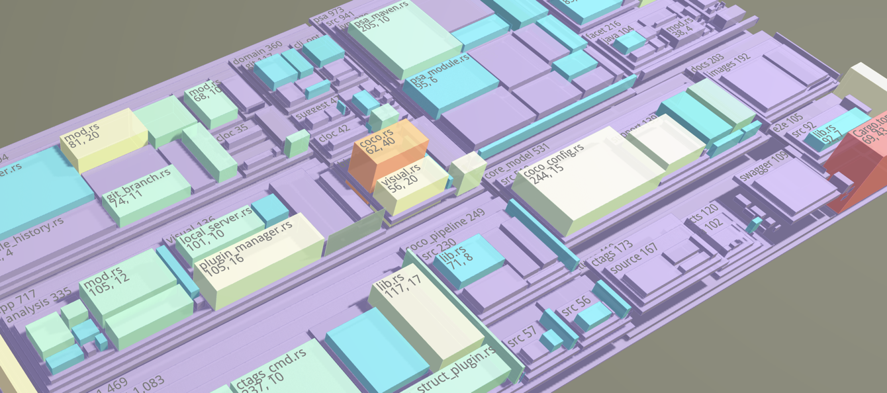

# 城市隐喻

## 解决方案


### 结构

示例 Codecity：

> 城市隐喻依赖于软件结构和城市之间的相似性。研究人员以不同的方式实例化了城市隐喻，不同之处在于软件构建的方式及其通过城市隐喻在视觉上描述的特征。 
 
《On the use of virtual reality in software visualization: The case of the city metaphor》

#### Codecity 

示例 1：

每个平行六面体的视觉属性代表该类的软件指标：

- 建筑物的高度反映了方法数量（NOM）——建筑物越高，方法数量越多。
- 建筑物的基础大小对应于属性数（NOA）——基础越大，属性数越多。
- 建筑物的颜色映射到行数（LOC）——深蓝色表示几行代码，而浅蓝色表示多行代码。

块代表包。同一个包中的类放在同一个块中。根据包的嵌套级别，块的颜色范围从深灰色到浅灰色。

示例 2：[https://github.com/modernizing/codecity](https://github.com/modernizing/codecity)



- 颜色 => Git 变更，包括增加、删除、移动、重命名等，
- 大小 => LOC

```javascript
let CityInfo = {
  maxLines: 0,
  maxChanges: 0,
  pool: undefined
}
```

#### VR 示例

