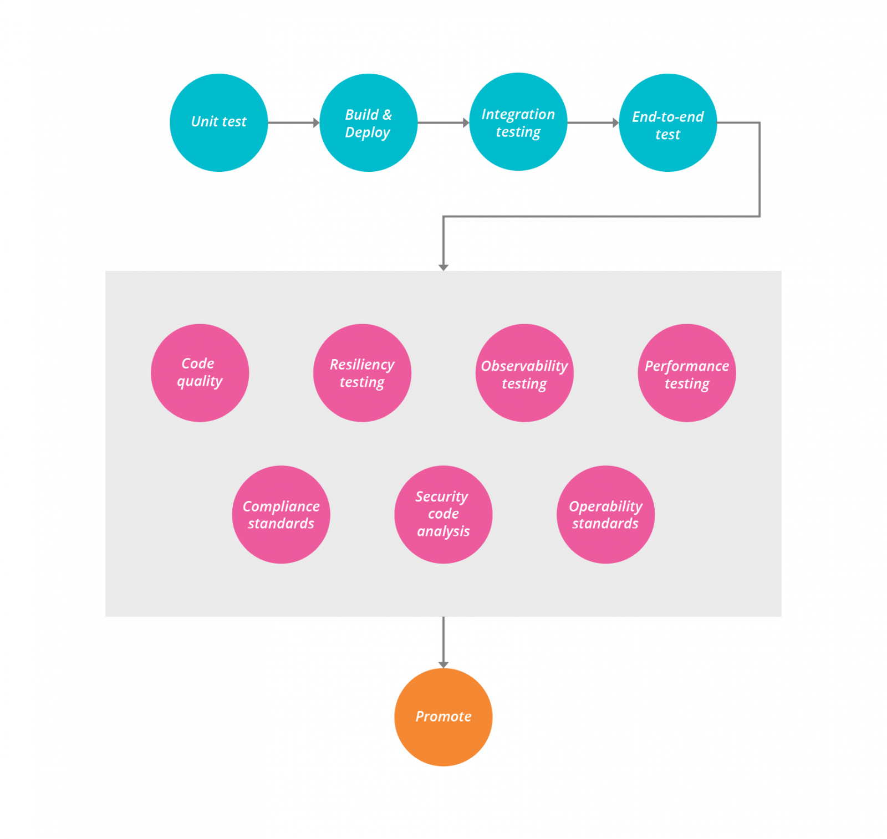

# 架构适应度函数

架构的适应度函数为某些架构特征提供了客观的完整性评估。 适应度函数，本质上就是一组评估函数，用以评估架构在不同维度上的表现（性能、可靠性、安全性、伸缩性、代码规范等），
并从全局角度进行平衡，从而实现增量和引导式演进。 适应度函数不单指特定的一种方法（如，单体测试），而是所有能够评估架构性能的方法。

## 问题

在软件架构演进过程中，我们需要对架构进行评估，以便于我们对架构进行改进。 评估的目的是为了找到最优的架构，而不是为了找到最好的架构。

## 解决方案：应用度函数驱动

步骤 =>
参考《[Fitness function-driven development](https://www.thoughtworks.com/insights/articles/fitness-function-driven-development)》：

1. 将架构视为具有用户旅程的产品，并首先收集业务、合规性、运营、安全、基础架构和应用程序开发的利益相关者的意见，以了解他们认为对业务成功最重要的架构属性。
2. 评估利益相关者的动机并从整体上优先考虑对组织重要的质量。检查这些主题通常会发现潜在的冲突或架构权衡。
3. 收集适应度函数后，在测试框架中起草它们。创建所需的适应度函数——并将它们包含在适当的交付管道中——将这些指标作为企业架构的一个重要方面进行传达。

### 示例

适应度函数示例：

流程示例：

### 示例：Fitness Function 工作坊

Fitness Function katas 旨在作为一个小团体（3-5 人）练习，通常作为更大团体（4-10 组是理想的）的一部分，每个人都在做不同的 kata。 
主持人跟踪时间，分配 Katas（或允许本网站随机选择一个），并充当练习的促进者。

相关资料：http://evolutionaryarchitecture.com/ffkatas/index.html

[List Katas](http://evolutionaryarchitecture.com/ffkatas/list.html)

### 相关：主序列距离适应度函数

## 相关资源

- 《演进式架构》
- 《[Fitness function-driven development](https://www.thoughtworks.com/insights/articles/fitness-function-driven-development)》
