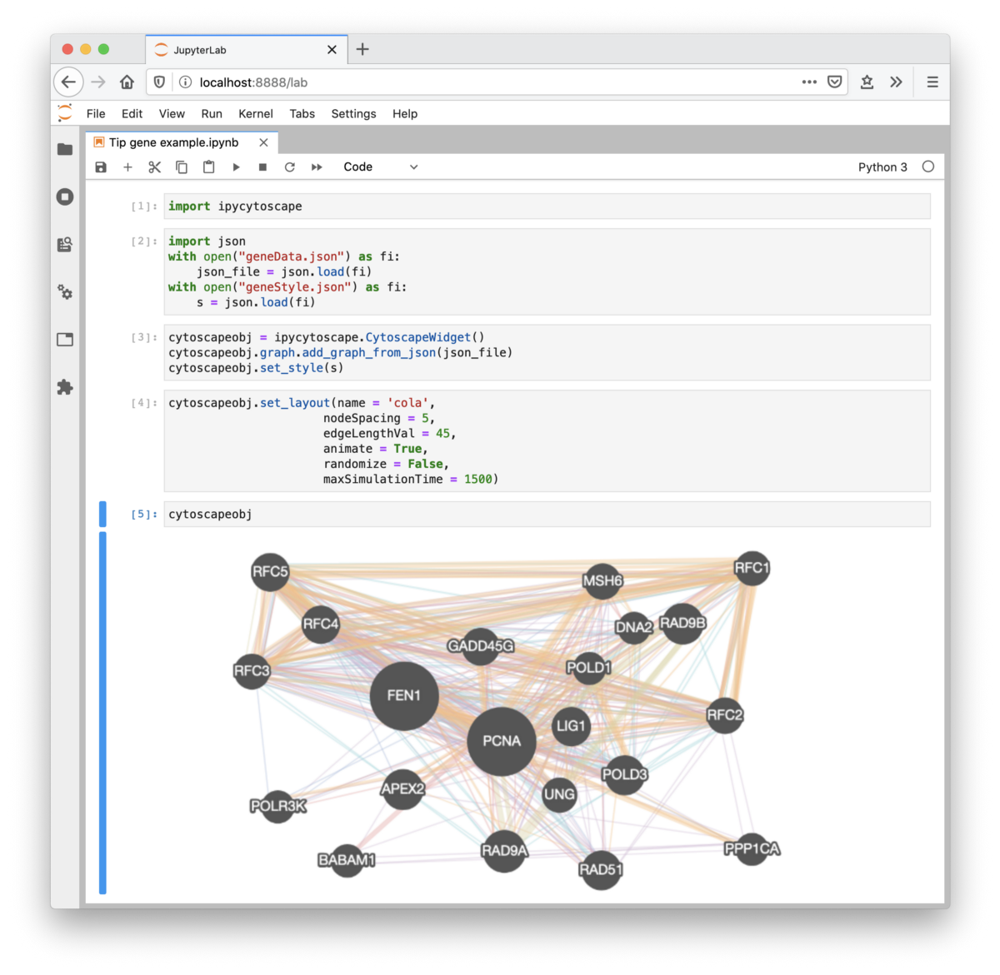

# 交互式分析

交互式数据分析是实时分析的扩展，通过结合分布式数据库系统和呈现功能加速分析过程，并帮助用户最大限度地发挥商业智能技术的分析能力。

高级交互式分析系统提供强大的功能组合，例如瞬时交叉过滤、地理空间探索、内存分析、多层地理图表、多源仪表板和高速数据，可帮助分析师可视化
、探索和取证检查大型非结构化数据集 以动态方式实时进行。

## 问题

如何实时通过编程快速进行数据分析？？

## 解决方案

### 示例： Jupyter

Jupyter Notebook 是一个 Web 应用程序，
可以在浏览器中运行代码并显示结果。它可以用于交互式数据分析，数据可视化，机器学习等。Jupyter Notebook 由 Jupyter 项目提供，该项目是
IPython
项目的后续项目。Jupyter Notebook 项目的目标是创建一个开放的文档格式，用于交互式数据科学和科学计算。Jupyter Notebook 支持 40
多种编程语言，
包括 Python，R，Scala，Julia 等。

### 示例：Kotlin Jupyter

GitHub: https://github.com/Kotlin/kotlin-jupyter

相关资源：

* Nteract 提供了一系列的组件、SDK 来，用来构建交互式应用，诸如于消息通信等等。然而 Nteract ，在设计的时候主要是在 Electron
  环境下使用，所以有一些库是无法使用的，如 ZeroMQ —— 设计时是只针对于 Node 环境的。
* Zeppelin 构建了一个更简单的执行环境（Interpreter），与 Jupyter 的 Kernel API 相比，它可以提供一些更有意思的实现层面的抽象。

相关文章：

- 《[高性能可视化架构：一个交互式实时数据引擎的架构设计](https://www.phodal.com/blog/high-performance-frontend-component/)》

